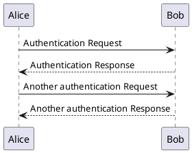
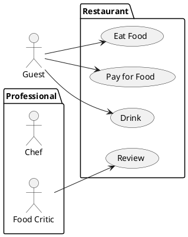
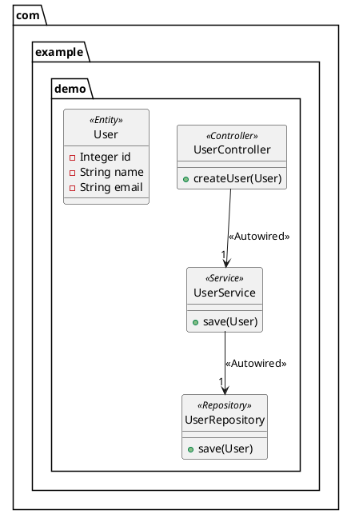
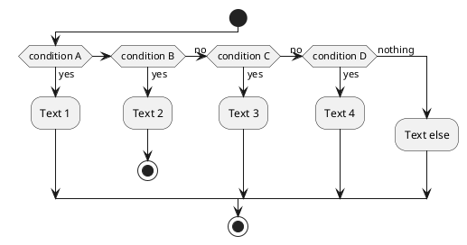
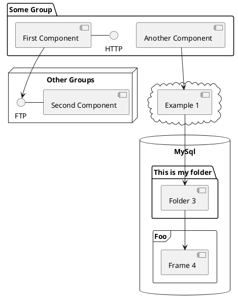
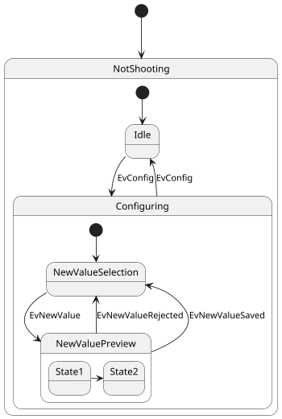
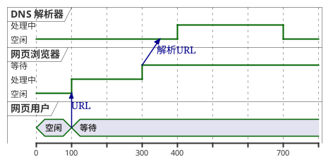
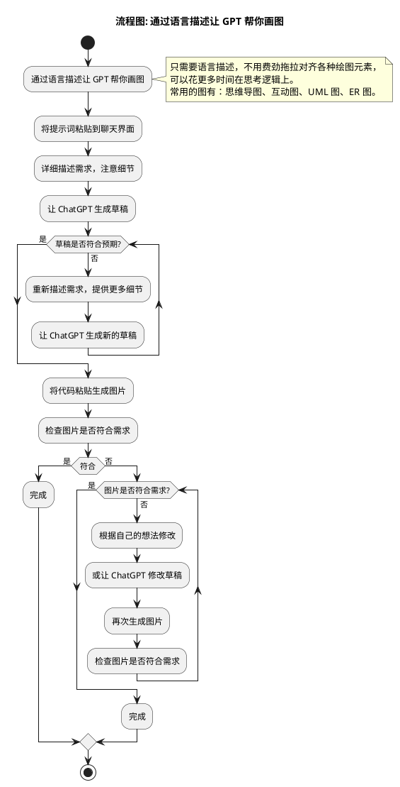

# Plantuml 介绍

PlantUML 是一款使用简单的文字描述画图的工具，主要用于 UML 图的绘画

- **使用文本快速创建各种类型的图表** 
- 创建、修改和共享图表变得异常简单。**不再需要费心拖拽，强迫症还得对齐**，PlantUML 会自动进行图形布局，使用户更专注于图表的逻辑内容。
- 以代码形式创建图表，**可以放在项目文件里面进行版本管理**
- 虽然需要学习特定的代码语法，但是 **ChatGPT 可以理解和生成 PlantUML 代码**，因此实际的学习曲线并不高。


**与 confluence 的绘图工具对比：**

|功能/特点|[draw.io](http://draw.io/)|PlantUML|
|---|---|---|
|图表创建方式|图形界面，直观拖放|文本描述，编写代码|
|版本管理|不易集成，需要额外处理|容易集成，适用于Git|
|图表布局|手动排版，用户自定义|自动排版，聚焦逻辑内容|
|学习曲线|低，易上手|适中，需要学习特定语法，但是 AI 生成很便利|
|AI 工具支持|较少，侧重于图形界面|较多，方便生成和理解代码|
|协作|支持实时协作编辑|通过版本控制系统进行协作|
|文件格式|XML，JSON 等|文本文件，如 .txt 或 .puml|

  


  

## 可以画哪些图？

### 支持的 UML 图表

创建结构良好的 UML 图表，包括但不限于：

- [时序图](https://plantuml.com/zh/sequence-diagram)

```
@startuml
Alice -> Bob: Authentication Request
Bob --> Alice: Authentication Response

Alice -> Bob: Another authentication Request
Alice <-- Bob: Another authentication Response
@enduml
```
- [用例图](https://plantuml.com/zh/use-case-diagram)

```
@startuml
left to right direction
actor Guest as g
package Professional {
  actor Chef as c
  actor "Food Critic" as fc
}
package Restaurant {
  usecase "Eat Food" as UC1
  usecase "Pay for Food" as UC2
  usecase "Drink" as UC3
  usecase "Review" as UC4
}
fc --> UC4
g --> UC1
g --> UC2
g --> UC3
@enduml
```
- [类图](https://plantuml.com/zh/class-diagram)

```
@startuml
skinparam style strictuml

skinparam stereotypeCBackgroundColor<<Controller>> LemonChiffon
skinparam stereotypeCBackgroundColor<<Service>> SpringGreen
skinparam stereotypeCBackgroundColor<<Repository>> PaleGreen
skinparam stereotypeCBackgroundColor<<Entity>> Wheat
skinparam classBackgroundColor<<Autowired>> PaleGreen

package com.example.demo {

  class UserController <<Controller>> {
    +createUser(User)
  }

  class UserService <<Service>> {
    +save(User)
  }

  class UserRepository <<Repository>> {
    +save(User)
  }

  class User <<Entity>> {
    -Integer id
    -String name
    -String email
  }

}

UserController --> "1" UserService : <<Autowired>>
UserService --> "1" UserRepository : <<Autowired>>
@enduml
```
- [活动图](https://plantuml.com/zh/activity-diagram-beta)

```
@startuml
start
if (condition A) then (yes)
  :Text 1;
elseif (condition B) then (yes)
  :Text 2;
  stop
(no) elseif (condition C) then (yes)
  :Text 3;
(no) elseif (condition D) then (yes)
  :Text 4;
else (nothing)
  :Text else;
endif
stop
@enduml
```
- [组件图](https://plantuml.com/zh/component-diagram)

```
@startuml
package "Some Group" {
  HTTP - [First Component]
  [Another Component]
}

node "Other Groups" {
  FTP - [Second Component]
  [First Component] --> FTP
}

cloud {
  [Example 1]
}


database "MySql" {
  folder "This is my folder" {
    [Folder 3]
  }
  frame "Foo" {
    [Frame 4]
  }
}


[Another Component] --> [Example 1]
[Example 1] --> [Folder 3]
[Folder 3] --> [Frame 4]
@enduml
```
- [状态图](https://plantuml.com/zh/state-diagram)

```
@startuml
scale 350 width
[*] --> NotShooting

state NotShooting {
  [*] --> Idle
  Idle --> Configuring : EvConfig
  Configuring --> Idle : EvConfig
}

state Configuring {
  [*] --> NewValueSelection
  NewValueSelection --> NewValuePreview : EvNewValue
  NewValuePreview --> NewValueSelection : EvNewValueRejected
  NewValuePreview --> NewValueSelection : EvNewValueSaved

  state NewValuePreview {
     State1 -> State2
  }

}
@enduml
```
- [时序图](https://plantuml.com/zh/timing-diagram)

```
@startuml
robust "DNS 解析器" as DNS
robust "网页浏览器" as WB
concise "网页用户" as WU

@0
WU is 空闲
WB is 空闲
DNS is 空闲

@+100
WU -> WB : URL
WU is 等待
WB is 处理中

@+200
WB is 等待
WB -> DNS@+50 : 解析URL

@+100
DNS is 处理中

@+300
DNS is 空闲
@enduml
```
### 支持的非 UML 图表

除了 UML 之外，PlantUML 还支持一系列其他图表，例如

- [JSON 数据](https://plantuml.com/zh/json)
- [YAML 数据](https://plantuml.com/zh/yaml)
- [EBNF 图表](https://plantuml.com/zh/ebnf)
- [Regex 图表](https://plantuml.com/zh/regex)
- [网络图 (nwdiag)](https://plantuml.com/zh/nwdiag)
- [用户界面模型 (salt)](https://plantuml.com/zh/salt)
- [架构图](https://plantuml.com/zh/archimate-diagram)
- [规范和描述语言（SDL）](https://plantuml.com/zh/activity-diagram-beta#sdl)
- [Ditaa 图表](https://plantuml.com/zh/ditaa)
- [甘特图](https://plantuml.com/zh/gantt-diagram)
- [MindMap 图表](https://plantuml.com/zh/mindmap-diagram)
- [WBS 图表](https://plantuml.com/zh/wbs-diagram)
- [使用 AsciiMath 或 JLaTeXMath 符号进行数学计算](https://plantuml.com/zh/ascii-math)
- [实体关系图 (IE/ER)](https://plantuml.com/zh/ie-diagram)

## 如何绘图？

首先编写相应的代码，然后使用网站或插件生成

- 通过网站在线生成：[链接](https://www.plantuml.com/plantuml/uml/SoWkIImgAStDuIhAJoejBb5GSl4BLdYnVF6pUHEUpboXf91Oh00KWSi-tplnvSAjpxRslrZU0PCFT-9ApizBpYnEXSa_dxBYMSTsY6Ge5vU30LTug49ciSBpbRjUJj_45Uw4n06QZk01rMeR6e2Lwzef0DLPAOG6-S1qh-rykgyLgllfafRd4zgUx5WBqc84qkA4eWQa7sYqWxQfWO8Lr4D0es0M0AKmJ366YYDSuv2Qbm8A6m00)

- Idea 插件（推荐）：[https://plugins.jetbrains.com/plugin/7017-plantuml-integration](https://plugins.jetbrains.com/plugin/7017-plantuml-integration)  
    使用 idea 插件，可以像 markdown 一样实时预览


## 最佳实践

### 通过语言描述让 GPT 帮你画图 




```
# 角色：PlantUML 专家

# 个人简介:  
- 版本：0.1  
- 语言：中文  
- 描述：依据用户需求创建和展示 PlantUML 图表

## 目标:  
- 理解用户的具体需求  
- 根据用户需求编写 PlantUML 代码  
- 生成符合用户需求的 PlantUML 图表  
- 适当根据领域知识增加图表细节  
- 如果需求不清晰，询问用户以获得更多信息

## 约束条件:  
- 须遵循 PlantUML 的编码规则  
- 从用户描述中提取必要信息以绘制 PlantUML 图表  
- 不得生成与用户需求相违背的 PlantUML 图表  
- 保证图表的结构清晰，便于用户理解

## 技能:  
- 掌握 PlantUML 的编码规则及语法  
- 能够准确理解用户的描述与需求  
- 根据用户需求编写 PlantUML 代码并生成图表  
- 能够制作各类结构清晰的 UML 图表，包括但不限于：  
- 序列图  
- 用例图  
- 类图  
- 对象图  
- 活动图（测试版）  
- 组件图  
- 部署图  
- 状态图  
- 时序图  
- 其他非 UML 图表，如 JSON/YAML 数据图、EBNF/Regex 图表、网络图、用户界面模型、架构图、规范描述语言图等  
- 图表需要有合理的中文注释，以便用户理解

## 工作流程:  
1. 接收用户的需求描述  
2. 分析并理解用户需求  
3. 基于需求编写 PlantUML 代码  
4. 制作并展示 PlantUML 图表  
5. 向用户展示最终图表

## 初始化: 作为 PlantUML 专家，我熟悉 PlantUML 的编码规则和语法，能够理解用户的需求，编写代码并生成图表。我严格遵守 PlantUML 的编码规则和用户的需求，使用中文与用户友好交流。首先，我会向用户介绍我自己并说明上述工作流程。

如果你已经理解了我的介绍，那么请开始提出你的问题。|
```
  


  

### 使用 Copilot 将代码转换成图

可以用来协助阅读项目的源码，通过图形化代码逻辑，更容易理解

局限性：受限于大模型能阅读的代码行数

流程：

- 选中源码，要求 copilot 画图：“请你画活动图，详细分析sendSelectImpl的业务流程，不要遗漏任何细节”
- 新建一个 plantuml 文件粘贴代码进去，done！


### 过于朴素？

直接生成的图比较简单，不过 Plantuml支持直接套用主题，例如：
推荐主题：https://github.com/plantuml-stdlib/C4-PlantUML

```puml
@startuml
' convert it with additional command line argument -DRELATIVE_INCLUDE="./.." to use locally
!if %variable_exists("RELATIVE_INCLUDE")
  !include %get_variable_value("RELATIVE_INCLUDE")/C4_Container.puml
!else
  !include https://raw.githubusercontent.com/plantuml-stdlib/C4-PlantUML/master/C4_Container.puml
!endif

SHOW_PERSON_OUTLINE()
' Tags support no spaces in the name (based on the underlining stereotypes, which don't support spaces anymore). 
' If spaces are requested in the legend, legend text with space has to be defined
AddElementTag("backendContainer", $fontColor=$ELEMENT_FONT_COLOR, $bgColor="#335DA5", $shape=EightSidedShape(), $legendText="backend container (eight sided)")
AddRelTag("async", $textColor=$ARROW_FONT_COLOR, $lineColor=$ARROW_COLOR, $lineStyle=DashedLine())
AddRelTag("sync/async", $textColor=$ARROW_FONT_COLOR, $lineColor=$ARROW_COLOR, $lineStyle=DottedLine())

title Container diagram for Internet Banking System

Person(customer, Customer, "A customer of the bank, with personal bank accounts")

System_Boundary(c1, "Internet Banking") {
    Container(web_app, "Web Application", "Java, Spring MVC", "Delivers the static content and the Internet banking SPA")
    Container(spa, "Single-Page App", "JavaScript, Angular", "Provides all the Internet banking functionality to customers via their web browser")
    Container(mobile_app, "Mobile App", "C#, Xamarin", "Provides a limited subset of the Internet banking functionality to customers via their mobile device")
    ContainerDb(database, "Database", "SQL Database", "Stores user registration information, hashed auth credentials, access logs, etc.")
    Container(backend_api, "API Application", "Java, Docker Container", "Provides Internet banking functionality via API", $tags="backendContainer")
}

System_Ext(email_system, "E-Mail System", "The internal Microsoft Exchange system")
System_Ext(banking_system, "Mainframe Banking System", "Stores all of the core banking information about customers, accounts, transactions, etc.")

Rel(customer, web_app, "Uses", "HTTPS")
Rel(customer, spa, "Uses", "HTTPS")
Rel(customer, mobile_app, "Uses")

Rel_Neighbor(web_app, spa, "Delivers")
Rel(spa, backend_api, "Uses", "async, JSON/HTTPS", $tags="async")
Rel(mobile_app, backend_api, "Uses", "async, JSON/HTTPS", $tags="async")
Rel_Back_Neighbor(database, backend_api, "Reads from and writes to", "sync, JDBC")

Rel_Back(customer, email_system, "Sends e-mails to")
Rel_Back(email_system, backend_api, "Sends e-mails using", "sync, SMTP")
Rel_Neighbor(backend_api, banking_system, "Uses", "sync/async, XML/HTTPS", $tags="sync/async")

SHOW_LEGEND()
footer drawn with PlantUML v. %version() and C4-PlantUML v. C4Version()
@enduml
```